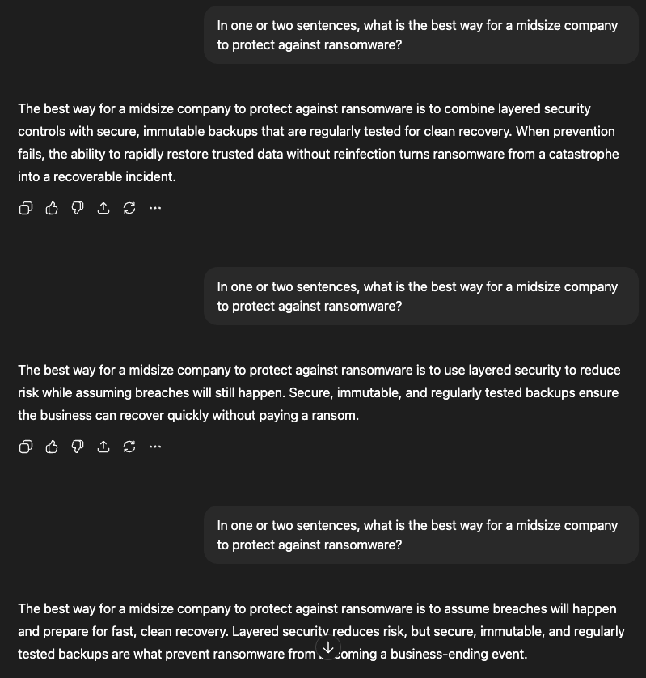

# 🧠 Lesson 1: AI Foundations - What's Actually Happening?

> **Goal:** Understand, at a high level, how LLMs actually work - and why even when we send the same prompt, we get different answers - all that seem to make sense...

## 🤔 Gone Are The Days Of Predictability

So, we send AI some input, and we get some output - seems pretty simple right? Well, Yes and No - It's simple in terms of we ask a question, and we get an answer. But if we go and ask that same question again, we get a different answer - sometimes similar, sometimes not - what's the deal here?



So - what is it? Layered Security? Immutable Backups? Assume Breach? Testing?

Honestly all the answers are right, but they are all different - and this is vastly different from what we are used to in terms of technology processes. When we design software, it's usually static in nature - we provide an input, and we often are able to predict the output. But, as you've seen, LLMs are not traditional software! To help break this down, let's explore at a high level what is actually happening when AI produces that answer...

## 🧠 What's Going On Under The Hood

I'll try and be brief here, because you've probably already read about this in one spot or another, but for those that haven't, let me try and break this down...

At it's core, an LLM really does one thing:

> 🔤 It predicts the next piece of text based on everything came before it.

It doesn't:
* Store facts
* Plan responses
* Decide what it "wants" to say

Instead, at every step, it asks:
> Given everything I've seen thus far, what text is likely to come next?

Rinse, Repeat - Simple!

**Note:** Internally, models don’t work with raw text the way we do. Text is converted into a numerical form that the model can work with. We’ll explore how this works in the next lesson.

### Why That Leads to Different Answers

Here’s the important part that explains the behavior you just observed.

At many points while generating a response, there isn’t just **one** reasonable way to continue. There are often **several** that all make sense.

For example, after starting an answer, the model might see that continuing with:

* a definition  
* an example  
* a best practice  
* or a warning  

would *all* be reasonable next steps.

Rather than always picking the exact same continuation every time, the model is designed to allow a bit of variation when choosing what comes next. This helps responses sound more natural and less repetitive. 

That means:
* The **core idea** usually stays the same
* The **wording and structure** can change
* Multiple answers can all be “correct”

This is why you see answers that make sense, but aren’t identical.

**Note:** This randomness or variation is controlled by the temperature of the model - Like tokens, this will be explored further in a later lesson.

## Try It Out

Alright, enough theory, enough reading - let's actually try this out on our own

Today we have some pretty simple code to run - we are going to connect to our OpenAI instance, ask a question, and view the response. Then, we'll do it again, and again, and again - and what you will notice is, it's not the same answer - similar yes, but not the same - let's do it!

### Getting Started

Before we can interact with OpenAI, you'll need to give the code access to your API key. 

If you need help signing up for OpenAI and creating an API key - [follow these instructions](https://platform.openai.com/docs/quickstart)...

Within the examples folder you will find a file called `.env.example` - Go ahead and paste your API key in there, rename the file to just `.env` and save!

Also, as with many python based projects, we are probably best to leverage venv - so let's do that! 

From inside the `lesson-01-foundations/examples/`:

*Mac OS / Linux*

```bash
python3 -m venv .venv
source .venv/bin/activate
```

* Windows PowerShell*
```powershell
python -m venv .venv
.\.venv\Scripts\Activate.ps1
```

Finally, let's install our packages
```bash
pip install -r requirements.txt
```

### Let's Run It!

Alright, time for the fun part, go ahead and run the code
```bash
python3 same_prompt_different_answers.py
```

Notice anything, same question, 3 different answers - and they are probably different than mine - here's what I got...
```

Response 1:

A large language model (LLM) is a type of artificial intelligence designed to understand, generate, and manipulate human language by analyzing vast amounts of text data. It uses deep learning techniques, particularly neural networks with many layers, to recognize patterns, context, and relationships between words and phrases. This enables the model to perform diverse language tasks such as translation, summarization, question-answering, and creative writing. The "large" aspect refers to the model’s extensive size in terms of parameters and the volume of training data, which collectively enhance its ability to produce coherent, relevant, and contextually accurate responses across a wide range of topics.

Response 2:

A large language model (LLM) is an advanced type of artificial intelligence trained on vast amounts of text data to understand, generate, and manipulate human language. These models use deep learning techniques, particularly neural networks with many layers and parameters, to capture complex patterns and relationships within the text. As a result, LLMs can perform a wide range of language-related tasks such as translation, summarization, question answering, and creative writing by predicting and generating coherent and contextually relevant text based on the input they receive. Their size and training enable them to handle nuanced language understanding and produce outputs that often appear highly human-like.

Response 3:

A large language model (LLM) is an advanced type of artificial intelligence designed to understand, generate, and manipulate human language by analyzing vast amounts of text data. These models are built using deep learning techniques, particularly neural networks with many layers and parameters, enabling them to capture complex patterns and nuances in language. By learning from extensive training corpora, LLMs can perform a wide range of tasks such as translating languages, answering questions, summarizing text, and engaging in natural-sounding conversations. Their size and complexity allow them to generate coherent and contextually relevant responses, making them powerful tools in natural language processing applications.
```

### So What Actually Happened

First, let's break down the code we just ran a little bit. Moreso, let's just discard what really doesn't matter!

For the most part, all of this code was just setup - the only line within that file that really matters is this

```python
response = client.responses.create(
    model="gpt-4.1-mini",
    input=prompt,
)
```

This line:

* Sends your prompt to the model
* Asks it to generate text
* Returns a probabilistic response

The key takeaway:
> You sent the same prompt multiple times, and the model generated different outputs - on purpose!

And for the model itself - well, at no point did it:

* Remember any previous responses
* Compare the different answers it replied with
* Decide to be creative
* Verified any correctness or accuracy (yikes!)

Each request is stateless and independent - every one starts from nothing!

## 📝 Lesson 1 Takeaways (Lock These In)

Before moving on, you should be comfortable with these statements:

* 🤖 A language model predicts text one piece at a time
* 🎲 Responses vary because output is probabilistic
* 🔁 Same input does not guarantee same output
* 🧠 The model does not “think” or “remember”
* 🧱 Everything else we build adds structure around this

If any of those still feel fuzzy, rerun the script a few more times and reread the earlier sections.

In the next lesson, we’ll look more closely at how text is broken down internally, and why the model “sees” language differently than we do.
